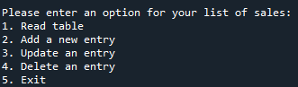
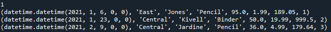
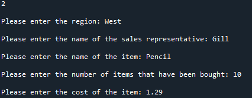
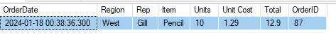

# Description
A Python script that accesses a local database that contains a table of sales orders in SQL Server.

# Setup

SQL Server was set up by installing SQL Server Management Studio (SSMS) through the following link: https://learn.microsoft.com/en-us/sql/ssms/download-sql-server-management-studio-ssms?view=sql-server-ver15

as well as the express version of SQL server through the download link: https://www.microsoft.com/en-us/sql-server/sql-server-downloads

Once SSMS is opened, connect to SQL server and then right-click the "Databases" Folder to make a new database and call it "PracticeDatabase". To import the spreadsheet, right-click the database and select "Tasks > Import Data". Then follow the steps of the SQL Server Import and Export Wizard using Microsoft Excel as a data source and SQL Server Native Client [version number] as a destination.

To set up the connection in the Python script, the ODBC driver and server name may need to be renamed. The server name is what is used to connect to SQL server and the driver name is found by searching for "ODBC Data Source Administrator" and then going to the "Drivers" tab to find what ODBC drivers are installed.

# Functions
### View Table

Displays the table.
### Add an Entry

Allows you to enter a new sales order by filling in a series of properties (region, item, price, etc.). After filling out the entry, the date/time, order ID number, and total cost of the item is automatically input into the table.

### Update an Entry

Asks the user to choose a row to edit by order ID, then asks what property of the sale should be edited such as region, item, etc.. The date/time is also updated and also the total price if applicable upon editing. The order can be edited until the user exits.

### Delete an Entry

Allows you to delete a row by entering the sale's order ID.

# Demo Screenshots

# References and Other Notes
The spreadsheet was obtained from sample data file 1 - "Office Supply Sales" from the following link: https://www.contextures.com/xlsampledata01.html

An additional column was made for order ID.